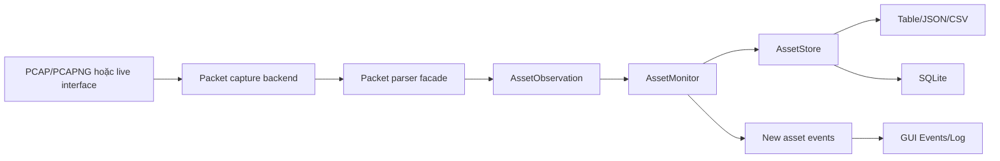
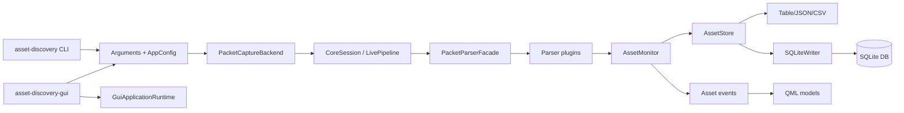
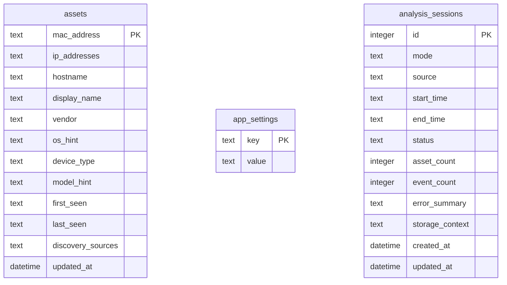
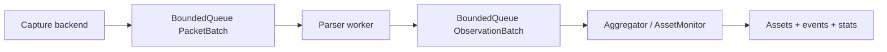

# Báo Cáo Đề Tài: Passive Network Asset Discovery System

## Mục Lục

- [Chương 1. Mở Đầu](#chương-1-mở-đầu)
- [Chương 2. Cơ Sở Lý Thuyết](#chương-2-cơ-sở-lý-thuyết)
- [Chương 3. Phân Tích Yêu Cầu](#chương-3-phân-tích-yêu-cầu)
- [Chương 4. Thiết Kế Hệ Thống](#chương-4-thiết-kế-hệ-thống)
- [Chương 5. Triển Khai Hệ Thống](#chương-5-triển-khai-hệ-thống)
- [Chương 6. Kiểm Thử Và Đánh Giá](#chương-6-kiểm-thử-và-đánh-giá)
- [Chương 7. Kết Luận Và Hướng Phát Triển](#chương-7-kết-luận-và-hướng-phát-triển)

---

# Chương 1. Mở Đầu

## 1.1. Bối Cảnh Đề Tài

Trong các hệ thống mạng hiện đại, số lượng thiết bị kết nối ngày càng tăng và ngày càng đa dạng. Một mạng nội bộ không chỉ có máy tính cá nhân và máy chủ, mà còn có điện thoại thông minh, máy in, camera IP, thiết bị IoT, router, switch, máy ảo và nhiều thiết bị chuyên dụng khác. Mỗi thiết bị đều có thể tạo ra rủi ro vận hành hoặc rủi ro an toàn thông tin nếu không được nhận diện, quản lý và theo dõi đầy đủ.

Quản trị viên mạng thường cần trả lời các câu hỏi cơ bản: trong mạng đang có những thiết bị nào, thiết bị đó dùng địa chỉ IP nào, địa chỉ MAC là gì, hostname hoặc tên hiển thị là gì, thiết bị xuất hiện khi nào và được phát hiện qua nguồn dữ liệu nào. Nếu quá trình kiểm kê chỉ thực hiện thủ công, thông tin dễ bị thiếu, chậm cập nhật và khó phản ánh đúng trạng thái thực tế.

Đề tài **Passive Network Asset Discovery System** được xây dựng để giải quyết nhu cầu trên bằng phương pháp phát hiện thụ động. Thay vì gửi gói tin quét đến thiết bị, hệ thống đọc lưu lượng có sẵn từ file PCAP/PCAPNG hoặc quan sát live capture trong GUI, phân tích các protocol có giá trị nhận diện và tổng hợp thành danh sách tài sản mạng.

## 1.2. Lý Do Chọn Đề Tài

Các công cụ phát hiện chủ động như ping sweep, ARP scan hoặc TCP/UDP scan có thể phát hiện thiết bị nhanh, nhưng chúng tạo thêm lưu lượng mạng và có thể gây cảnh báo hoặc ảnh hưởng đến thiết bị nhạy cảm. Trong một số môi trường vận hành, việc chủ động gửi probe đến thiết bị không được khuyến khích vì có thể làm thay đổi trạng thái mạng hoặc gây nhiễu cho hệ thống giám sát.

Phát hiện thụ động là một hướng tiếp cận ít xâm lấn hơn. Hệ thống chỉ quan sát lưu lượng đã tồn tại, trích xuất thông tin từ các gói tin như ARP, DHCP, DNS, mDNS, SSDP, NetBIOS hoặc TCP SYN-ACK. Các giao thức này có thể tiết lộ địa chỉ IP, địa chỉ MAC, hostname, tên dịch vụ, gợi ý hệ điều hành, loại thiết bị hoặc nhà sản xuất.

Với hướng tiếp cận này, đề tài vừa có giá trị thực tiễn trong quản trị mạng, vừa phù hợp để nghiên cứu các chủ đề hệ thống như packet capture, parsing nhị phân, pipeline đa luồng, lưu trữ SQLite, giao diện desktop Qt/QML và đóng gói Docker.

## 1.3. Vấn Đề Đặt Ra

Quá trình phát hiện tài sản mạng thụ động có một số khó khăn chính.

Thứ nhất, dữ liệu nhận diện thiết bị thường phân tán ở nhiều gói tin. ARP có thể cung cấp IP và MAC, DHCP có thể cung cấp MAC, IP và hostname, mDNS có thể cung cấp tên dịch vụ, SSDP có thể cung cấp loại thiết bị hoặc model. Hệ thống cần gom các quan sát rời rạc này thành một asset thống nhất.

Thứ hai, cùng một thiết bị có thể đổi IP hoặc xuất hiện nhiều lần trong nhiều packet khác nhau. Nếu không có cơ chế merge hợp lý, hệ thống sẽ tạo dữ liệu trùng lặp hoặc làm mất lịch sử quan sát.

Thứ ba, lưu lượng mạng có thể không đầy đủ. Phương pháp thụ động chỉ phát hiện được thiết bị có phát sinh traffic trong khoảng thời gian quan sát. Hệ thống cần thể hiện rõ giới hạn này và không giả định rằng inventory thu được là toàn bộ mạng.

Thứ tư, việc triển khai live capture phụ thuộc vào quyền hệ thống. Trên Linux, capture trực tiếp thường cần quyền raw socket hoặc capability `CAP_NET_RAW`/`CAP_NET_ADMIN`. Khi chạy bằng Docker, cần tách workflow demo PCAP quyền thấp khỏi workflow live capture có quyền mạng cao hơn.

## 1.4. Mục Tiêu Của Đề Tài

Mục tiêu tổng quát là xây dựng một hệ thống phát hiện tài sản mạng thụ động có thể phân tích lưu lượng mạng, tổng hợp danh sách asset và cung cấp kết quả qua CLI, GUI, SQLite và Docker demo.

Các mục tiêu cụ thể gồm:

- Đọc file PCAP/PCAPNG Ethernet để phân tích ngoại tuyến.
- Capture trực tiếp từ network interface trong GUI khi có quyền phù hợp.
- Phân tích các protocol nhận diện tài sản gồm ARP, DHCP, DNS, mDNS, LLMNR, SSDP, NetBIOS, TCP SYN-ACK và IPv4 endpoint enrichment.
- Tạo observation từ packet và gom nhóm theo MAC address.
- Duy trì các trường asset như IP, hostname, display name, vendor, OS hint, device type, model hint, first seen, last seen và discovery sources.
- Xuất inventory qua table, JSON và CSV.
- Lưu inventory, settings và lịch sử phiên phân tích trong SQLite.
- Cung cấp GUI desktop Qt/QML với Dashboard, Capture, Assets, Events và Settings.
- Cung cấp Docker Compose cho demo GUI PCAP và live capture.
- Xây dựng bộ kiểm thử tự động cho parser, capture, storage, GUI model, GUI smoke và pipeline.

## 1.5. Phạm Vi Nghiên Cứu

Phạm vi đề tài tập trung vào phát hiện tài sản mạng trong mạng LAN bằng phương pháp thụ động. Hệ thống không thực hiện quét chủ động, không đánh giá lỗ hổng, không khai thác dịch vụ và không phân tích nội dung payload nhạy cảm ngoài các metadata cần thiết cho nhận diện asset.

Dữ liệu đầu vào gồm:

- File `.pcap` hoặc `.pcapng` có link type Ethernet.
- Live packet stream từ network interface trong GUI.

Dữ liệu đầu ra gồm:

- Inventory asset dạng table, JSON, CSV.
- Dữ liệu SQLite gồm `assets`, `app_settings` và `analysis_sessions`.
- Event/log trong GUI và stdout của CLI.
- Export JSON/CSV từ GUI.

Các chức năng như tích hợp SIEM, dashboard web, quét chủ động, phân tích lỗ hổng, lưu lịch sử asset đầy đủ theo thời gian hoặc phân loại thiết bị bằng học máy được xem là hướng phát triển tương lai.

## 1.6. Phương Pháp Thực Hiện

Đề tài được thực hiện theo hướng thiết kế module và kiểm thử lặp lại bằng fixture PCAP. Trước hết, các giao thức có giá trị nhận diện thiết bị được khảo sát. Sau đó, hệ thống được chia thành các phần: capture, parser, discovery domain, monitor, renderer, storage, GUI và Docker runtime.

Luồng xử lý tổng quát:



Trong quá trình triển khai, hệ thống được kiểm thử bằng các fixture nhỏ để dễ xác minh kết quả và bằng các fixture lớn hơn để đánh giá khả năng gom thông tin từ nhiều protocol.

## 1.7. Ý Nghĩa Của Đề Tài

Về thực tiễn, hệ thống hỗ trợ quản trị viên có danh sách tài sản mạng cập nhật hơn từ lưu lượng quan sát được. Điều này giúp phát hiện thiết bị mới, kiểm tra thiết bị lạ và hỗ trợ quá trình quản lý tài sản.

Về kỹ thuật, đề tài là một bài toán tổng hợp nhiều nội dung quan trọng: xử lý packet, thiết kế parser plugin, quản lý trạng thái asset, concurrency trong live pipeline, lưu trữ SQLite, giao diện QML và triển khai Docker.

Về học thuật, đề tài giúp làm rõ ưu điểm và giới hạn của passive discovery: ít xâm lấn, phù hợp giám sát liên tục, nhưng phụ thuộc vào vị trí capture và mức độ phát sinh lưu lượng của thiết bị.

# Chương 2. Cơ Sở Lý Thuyết

## 2.1. Tài Sản Mạng

Tài sản mạng là thiết bị hoặc thành phần có khả năng kết nối và trao đổi dữ liệu qua mạng. Trong phạm vi đề tài, một asset thường được nhận diện bởi địa chỉ MAC, một hoặc nhiều địa chỉ IP, hostname hoặc tên hiển thị, nguồn phát hiện và các metadata bổ sung.

Một bản ghi asset không chỉ là một cặp IP/MAC. Trong mạng thực tế, IP có thể thay đổi do DHCP, hostname có thể chỉ xuất hiện trong một số protocol, còn MAC có thể gợi ý vendor thông qua OUI. Vì vậy mô hình asset cần đủ linh hoạt để chứa thông tin tổng hợp từ nhiều packet.

## 2.2. Phát Hiện Chủ Động Và Thụ Động

Phát hiện chủ động gửi packet probe vào mạng để tìm thiết bị. Cách này thường phát hiện nhanh nhưng tạo thêm lưu lượng và có thể bị coi là hành vi quét.

Phát hiện thụ động chỉ lắng nghe hoặc đọc lưu lượng đã có. Cách này ít xâm lấn hơn, phù hợp với môi trường cần ổn định, nhưng chỉ phát hiện được thiết bị có phát sinh packet trong phạm vi quan sát.

| Tiêu chí | Phát hiện chủ động | Phát hiện thụ động |
| --- | --- | --- |
| Tác động đến mạng | Có tạo thêm traffic | Không chủ động tạo traffic |
| Khả năng phát hiện thiết bị im lặng | Có thể nếu thiết bị phản hồi | Không phát hiện nếu không có traffic |
| Rủi ro gây cảnh báo | Cao hơn | Thấp hơn |
| Phù hợp với | Quét định kỳ, kiểm kê nhanh | Giám sát liên tục, ít xâm lấn |

## 2.3. Packet Capture Và PCAP

Packet capture là quá trình thu thập gói tin đi qua network interface. PCAP/PCAPNG là định dạng phổ biến để lưu lại packet cùng timestamp và thông tin datalink. File PCAP giúp kiểm thử lặp lại ổn định vì cùng một input sẽ tạo cùng một output kỳ vọng.

Trong hệ thống này, libpcap được dùng cho cả đọc file PCAP/PCAPNG và live capture. Hệ thống tập trung vào link type Ethernet vì địa chỉ MAC nguồn/đích là dữ liệu quan trọng để gom asset.

## 2.4. Ethernet, IPv4, UDP Và TCP

Ethernet cung cấp địa chỉ MAC nguồn và MAC đích. IPv4 cung cấp địa chỉ IP nguồn, IP đích và TTL. UDP/TCP cung cấp port và ngữ cảnh để xác định protocol tầng ứng dụng.

Một packet thường được xử lý theo các lớp:

```text
Ethernet frame
  -> IPv4 packet nếu EtherType là IPv4
    -> UDP hoặc TCP segment
      -> Protocol-specific payload
```

Parser cần kiểm tra kích thước buffer trước khi đọc từng header để tránh lỗi với packet bị cắt ngắn hoặc malformed.

## 2.5. ARP

ARP ánh xạ địa chỉ IPv4 sang địa chỉ MAC trong mạng LAN. Gói ARP thường chứa sender MAC, sender IP, target MAC và target IP. Đây là nguồn dữ liệu có độ tin cậy cao cho việc phát hiện asset trong mạng IPv4 nội bộ.

Hạn chế của ARP là không cung cấp hostname, vendor, model hoặc loại thiết bị. Vì vậy ARP thường là nguồn định danh cơ bản, cần kết hợp với DHCP, mDNS hoặc SSDP để có thông tin mô tả phong phú hơn.

## 2.6. DHCP

DHCP dùng để cấp phát cấu hình mạng tự động. Packet DHCP có thể chứa client MAC, địa chỉ IP được cấp, hostname, vendor class identifier và parameter request list.

Trong hệ thống, DHCP giúp bổ sung hostname và một số gợi ý OS. Ví dụ vendor class hoặc danh sách option được request có thể gợi ý Windows, Linux, macOS/iOS hoặc embedded Linux. Các gợi ý này không phải kết luận tuyệt đối, nhưng hữu ích cho quá trình kiểm kê.

## 2.7. DNS, mDNS Và LLMNR

DNS dùng để phân giải tên miền. Trong passive discovery, DNS có thể cung cấp thông tin về endpoint và các tên được truy vấn hoặc trả lời. mDNS và LLMNR hoạt động trong mạng cục bộ, thường xuất hiện khi thiết bị tự quảng bá hostname hoặc dịch vụ.

mDNS đặc biệt hữu ích với thiết bị Apple, máy in, smart home, media device và một số dịch vụ Zeroconf. Thông qua bản ghi PTR, SRV hoặc TXT, hệ thống có thể suy luận display name, service name, model hoặc vendor.

## 2.8. SSDP Và NetBIOS

SSDP là giao thức dùng trong UPnP, thường xuất hiện trên router, TV, camera, media renderer hoặc thiết bị IoT. Header như `SERVER`, `USN`, `ST`, `NT`, `LOCATION`, `friendlyName`, `modelName` có thể gợi ý loại thiết bị hoặc model.

NetBIOS Name Service xuất hiện trong một số môi trường Windows hoặc SMB legacy. Packet NBNS có thể chứa tên máy, hỗ trợ nhận diện thiết bị khi DHCP không cung cấp hostname.

## 2.9. TCP SYN-ACK Và IPv4 Enrichment

TCP SYN-ACK có thể cho thấy một asset đang phản hồi kết nối TCP, từ đó gợi ý vai trò server candidate. IPv4 TTL có thể được dùng như heuristic đơn giản để suy luận OS hint, ví dụ TTL thấp thường liên quan Linux/Unix, TTL khoảng 128 thường liên quan Windows.

Các heuristic này có độ tin cậy thấp hơn ARP/DHCP và chỉ nên xem là gợi ý. Báo cáo và UI cần thể hiện đây là thông tin hỗ trợ, không phải kết luận định danh chắc chắn.

## 2.10. OUI Và Metadata Enrichment

OUI là ba octet đầu của địa chỉ MAC được cấp cho nhà sản xuất. Hệ thống có curated OUI registry nhỏ để suy luận vendor như Apple, Google, Microsoft, Samsung, Cisco, VMware, VirtualBox, QEMU, Raspberry Pi, TP-Link, Ubiquiti và một số hãng khác.

Do MAC có thể được randomize hoặc locally administered, OUI chỉ là nguồn tham khảo. Hệ thống ghi nhận thêm metadata như `mac.is_multicast`, `mac.is_locally_administered`, `mac.oui` và derived hints để người dùng đánh giá.

## 2.11. Mô Hình Observation Và Asset

`AssetObservation` là dữ liệu trung gian sinh ra từ parser. Observation có thể chứa MAC, IP, hostname, display name, vendor, OS hint, device type, model hint, source ID, confidence, timestamp và metadata.

`Asset` là trạng thái tổng hợp cuối. Nhiều observation cùng MAC được gom vào một asset. Asset giữ `first_seen` sớm nhất, `last_seen` mới nhất, danh sách IP, nguồn phát hiện và các trường mô tả ưu tiên theo nguồn.

## 2.12. Vấn Đề Bảo Mật Và Quyền Riêng Tư

PCAP có thể chứa dữ liệu nhạy cảm như hostname, IP, MAC, tên dịch vụ và hành vi giao tiếp. Vì vậy hệ thống cần được sử dụng trong phạm vi được phép. Khi chia sẻ PCAP hoặc SQLite database, cần xem đó là dữ liệu nhạy cảm.

Hệ thống không lưu payload ứng dụng đầy đủ vào inventory. Mục tiêu là thu thập metadata cần thiết cho nhận diện tài sản, hạn chế xử lý dữ liệu riêng tư ngoài phạm vi đề tài.

# Chương 3. Phân Tích Yêu Cầu

## 3.1. Mô Tả Bài Toán

Bài toán cần giải quyết là xây dựng hệ thống có thể quan sát lưu lượng mạng, trích xuất thông tin nhận diện thiết bị và tạo inventory tài sản mạng. Hệ thống phải dùng được trong hai bối cảnh:

- Phân tích ngoại tuyến bằng CLI với file PCAP/PCAPNG.
- Quan sát trực tiếp bằng GUI với PCAP analysis hoặc live capture.

Đầu ra cần dễ kiểm tra bằng người dùng và dễ tích hợp bằng công cụ khác. Vì vậy hệ thống cung cấp table, JSON, CSV, GUI model, SQLite và export từ GUI.

## 3.2. Đối Tượng Sử Dụng

Các nhóm người dùng chính:

- Quản trị viên mạng cần kiểm kê thiết bị trong mạng nội bộ.
- Nhân sự an toàn thông tin cần phát hiện thiết bị lạ hoặc thay đổi asset.
- Người triển khai/demo cần chạy hệ thống bằng Docker.
- Sinh viên hoặc người nghiên cứu cần tìm hiểu packet capture, parser và passive discovery.

## 3.3. Yêu Cầu Chức Năng

### 3.3.1. Phân Tích PCAP/PCAPNG Bằng CLI

CLI `asset-discovery` phải đọc file `.pcap` hoặc `.pcapng`, áp dụng BPF filter, phân tích packet và xuất inventory. SQLite là bắt buộc đối với CLI, thông qua `--sqlite <file>` hoặc `SQLITE_DATABASE_PATH`.

Ví dụ:

```sh
./build/asset-discovery \
  --pcap samples/multi-asset.pcap \
  --sqlite /tmp/pnad-demo.db \
  --output table
```

CLI không được reset database đích. Nếu database đã có dữ liệu, asset trùng MAC được upsert/merge, còn asset khác, settings và analysis sessions hiện có được giữ lại.

### 3.3.2. Phân Tích Và Capture Bằng GUI

GUI `asset-discovery-gui` phải hỗ trợ:

- Dashboard tổng quan.
- Capture page với hai mode: PCAP/PCAPNG và Live Capture.
- Assets page hiển thị inventory và export JSON/CSV.
- Events page hiển thị event/log trong phiên chạy.
- Settings page cho SQLite path và email recipients.

Live capture cần kiểm tra quyền interface và báo diagnostic rõ ràng khi thiếu raw socket permission.

### 3.3.3. Parser Protocol

Hệ thống cần parser cho:

- ARP.
- DHCP.
- DNS/mDNS/LLMNR.
- SSDP.
- NetBIOS.
- TCP SYN-ACK.
- IPv4 endpoint enrichment.

Parser phải bỏ qua packet không đủ dữ liệu hoặc không khớp protocol thay vì làm chương trình crash.

### 3.3.4. Tổng Hợp Asset

Hệ thống phải gom observation theo MAC address. Khi có observation mới:

- MAC mới tạo asset mới.
- IP mới được thêm vào `ip_addresses`.
- Hostname/display name/vendor/OS/device type/model được cập nhật theo nguồn phù hợp.
- `first_seen` lấy timestamp sớm nhất.
- `last_seen` lấy timestamp mới nhất.
- `discovery_sources` là tập nguồn đã quan sát.

### 3.3.5. Lưu Trữ SQLite

SQLite phải lưu:

| Bảng | Mục đích |
| --- | --- |
| `assets` | Inventory asset theo MAC address |
| `app_settings` | Settings do GUI lưu |
| `analysis_sessions` | Lịch sử phiên phân tích/capture trong GUI |

Schema được migration bằng `PRAGMA user_version`. CLI và GUI cùng dùng `SQLiteWriter`, nhưng CLI chỉ ghi inventory từ PCAP hiện tại và không xóa dữ liệu cũ.

### 3.3.6. Email Alert

GUI cần hỗ trợ email alert khi có asset mới nếu người dùng bật cấu hình môi trường. SMTP settings được đọc từ `.env` hoặc process environment. Trong UI hiện tại, người dùng có thể chỉnh recipients trong Settings.

### 3.3.7. Docker Demo

Docker Compose cần có:

- `pnad-gui`: demo PCAP/SQLite/export quyền thấp.
- `pnad-gui-live`: live capture với host networking và capability `NET_RAW`, `NET_ADMIN`.
- `debug-cli`, `backend-status`, `backend-status-live`: hỗ trợ debug.
- `test`: chạy CTest trong image test.

## 3.4. Yêu Cầu Phi Chức Năng

### 3.4.1. Tính Đúng Đắn

Output phải ổn định, JSON parse được, CSV có header rõ ràng, table dễ đọc và SQLite không mất dữ liệu ngoài ý muốn. Parser phải không đọc vượt buffer.

### 3.4.2. Hiệu Năng

PCAP analysis cần xử lý nhanh đủ cho fixture và demo. Live pipeline cần batch packet, dùng queue có giới hạn và tách parser/aggregator để tránh tăng bộ nhớ không kiểm soát.

### 3.4.3. Tính Mở Rộng

Parser plugin cho phép thêm protocol mới mà không phải sửa toàn bộ pipeline. `AssetObservation` và structured metadata cho phép bổ sung thông tin enrichment trong tương lai.

### 3.4.4. Khả Năng Triển Khai

Hệ thống cần build được bằng CMake, chạy native trên Linux và chạy demo bằng Docker Compose. GUI Docker dùng X11 host display để mở Qt window trực tiếp.

### 3.4.5. Bảo Mật

Live capture yêu cầu quyền mạng; service Docker mặc định phải chạy quyền thấp và chỉ service live mới thêm capability cần thiết. Password email không nên commit vào `.env`.

## 3.5. Tiêu Chí Nghiệm Thu

Hệ thống được xem là đạt yêu cầu khi:

- Build thành công bằng `cmake --build build --parallel`.
- `ctest --test-dir build --output-on-failure` pass toàn bộ test.
- CLI phân tích `samples/multi-asset.pcap` và xuất đúng nhiều asset.
- CLI không xóa dữ liệu SQLite hiện có.
- GUI mở được, phân tích PCAP, hiển thị asset/event và export JSON/CSV.
- Docker `pnad-gui` chạy được workflow PCAP demo.
- `asset-capture --backend-status` báo được backend và permission status.

# Chương 4. Thiết Kế Hệ Thống

## 4.1. Kiến Trúc Tổng Thể

Hệ thống được chia thành nhiều module C++ độc lập để dễ kiểm thử và bảo trì.



Các executable chính:

| Executable | Vai trò |
| --- | --- |
| `asset-discovery` | CLI phân tích PCAP/PCAPNG offline |
| `asset-discovery-gui` | Ứng dụng desktop Qt/QML |
| `asset-capture` | Helper diagnostic cho capture backend và protocol self-test |

## 4.2. Thiết Kế Capture Layer

Capture layer nằm trong `src/capture/` và `include/pnad/capture/`. Thành phần chính là `PacketCaptureBackend`, có trách nhiệm:

- Kiểm tra libpcap backend.
- Đọc file PCAP/PCAPNG.
- Mở live capture interface.
- Áp dụng BPF filter.
- Liệt kê network interfaces và permission status.

`NetworkInterface` giúp GUI hiển thị interface, readiness và diagnostic. `asset-capture --backend-status` dùng cùng logic để kiểm tra backend trong container hoặc native runtime.

## 4.3. Thiết Kế Parser

Parser gồm:

- Packet primitives: Ethernet frame và ARP packet.
- Parser core: `PacketContext`, `ParserEngine`, `ParserRegistry`, `ParserInterface`.
- Parser plugins: ARP, DHCP, DNS, IPv4 endpoint, NetBIOS, SSDP, TCP.
- Facade: `PacketParserFacade`.

Luồng parser:

```text
Raw packet bytes
  -> EthernetFrame
  -> PacketContext
  -> ParserEngine
  -> Matching parser plugins
  -> AssetObservation list
```

Mỗi plugin có `match()` để xác định độ phù hợp và `parse()` để sinh observation. Thiết kế này giúp thêm protocol mới bằng cách tạo plugin mới và đăng ký vào `BuiltinParserPlugins`.

## 4.4. Thiết Kế Asset Domain

`AssetObservation` là dữ liệu tạm thời từ parser. `AssetStore` là trạng thái tổng hợp. `AssetMonitor` nhận observation, cập nhật store và phát event khi có asset mới.

Các trường chính của asset:

| Trường | Ý nghĩa |
| --- | --- |
| `macAddress` | Khóa định danh asset |
| `ipAddresses` | Tập địa chỉ IP quan sát được |
| `hostname` | Hostname từ DHCP/NetBIOS hoặc nguồn khác |
| `displayName` | Tên hiển thị ưu tiên từ hostname/mDNS/SSDP |
| `vendor` | Vendor từ OUI hoặc protocol metadata |
| `osHint` | Gợi ý hệ điều hành |
| `deviceType` | Gợi ý loại thiết bị |
| `modelHint` | Gợi ý model |
| `firstSeen` | Timestamp sớm nhất |
| `lastSeen` | Timestamp mới nhất |
| `sources` | Tập nguồn phát hiện |

## 4.5. Thiết Kế SQLite

SQLiteWriter tạo và migration database khi mở file. Schema hiện tại gồm:



`writeAssets()` dùng `INSERT ... ON CONFLICT(mac_address) DO UPDATE`. Với asset trùng MAC, SQLite cập nhật field mô tả bằng giá trị mới nếu có, giữ `first_seen` sớm nhất và `last_seen` mới nhất. Đây là cơ chế giúp CLI và GUI cập nhật inventory mà không tạo duplicate.

## 4.6. Thiết Kế CLI

CLI hiện chỉ hỗ trợ PCAP/PCAPNG offline analysis. Các cờ live hoặc cấu hình cũ như `--live`, `--interface`, `--config`, `--profile`, `--db-url`, `--events-json` được từ chối với thông báo migration.

Các tham số còn hỗ trợ:

- `--pcap <file>`.
- `--filter <bpf>`.
- `--broad-ipv4-enrichment`.
- `--sqlite <file>`.
- `--output table|json|csv`.
- `--version`.
- `--help`.

SQLite path là bắt buộc để tránh chạy phân tích không có nơi lưu inventory. CLI vẫn in output ra stdout theo format người dùng chọn.

## 4.7. Thiết Kế GUI

GUI được xây dựng bằng Qt/QML. Các model C++ expose sang QML:

- `CaptureController`: điều phối PCAP analysis/live capture, settings, validation, email alert.
- `AssetModel`: hiển thị asset và export JSON/CSV.
- `InterfaceModel`: liệt kê network interface và trạng thái permission.
- `LogModel`: hiển thị event/log.
- `GuiApplicationRuntime`: khởi tạo context property và refresh model từ SQLite.

Các màn hình QML chính:

- `DashboardPage.qml`: tổng quan asset.
- `CapturePage.qml`: chọn PCAP hoặc live capture.
- `AssetsPage.qml`: xem/filter/export asset.
- `EventsPage.qml`: xem log sự kiện.
- `SettingsPage.qml`: cấu hình SQLite path, recipients và validate settings.

## 4.8. Thiết Kế Live Pipeline

Live capture sử dụng pipeline có batch và queue giới hạn:



Thiết kế này tách capture khỏi parser và aggregation. Parser worker không cập nhật store trực tiếp; aggregator là single writer cho `AssetMonitor`, giúp giảm rủi ro race condition.

## 4.9. Thiết Kế Docker

Dockerfile dùng multi-stage build:

- Stage build/test cài toolchain, CMake, Qt, libpcap, SQLite và chạy build/test.
- Stage runtime chứa binary, Qt runtime, libpcap, SQLite và entrypoint.

Docker Compose tách hai workflow:

- `pnad-gui`: quyền thấp, dùng PCAP/SQLite/export.
- `pnad-gui-live`: host network và capability `NET_RAW`, `NET_ADMIN`.

Tách workflow như vậy giúp demo mặc định an toàn hơn, chỉ cấp quyền capture khi người dùng chủ động chạy service live.

# Chương 5. Triển Khai Hệ Thống

## 5.1. Công Nghệ Sử Dụng

| Công nghệ | Vai trò |
| --- | --- |
| C++17 | Ngôn ngữ triển khai chính |
| CMake | Build và cấu hình test |
| libpcap/Npcap | Đọc PCAP/PCAPNG và live capture |
| SQLite | Lưu inventory, settings và analysis sessions |
| Qt 5/Qt 6 + QML | GUI desktop |
| curl | Gửi email SMTP trong GUI |
| Docker/Compose | Đóng gói và demo runtime |
| CTest | Kiểm thử tự động |
| Python | Validate output JSON/SQLite trong một số integration test |

## 5.2. Cấu Trúc Repository

```text
include/pnad/      Header C++ theo module
src/app/           Live capture pipeline
src/capture/       PCAP/live capture và interface discovery
src/cli/           Parse CLI arguments
src/config/        AppConfig và loader default YAML
src/core/          CoreSession orchestration
src/discovery/     Asset domain, monitor và renderer
src/event/         AssetEvent và EventSink
src/gui/           Qt/C++ models và runtime
src/packet/        Parser primitives, core, plugins, facade
src/storage/       SQLiteWriter
qml/               QML screens và resource
tests/             Unit/integration/smoke tests
samples/           PCAP/PCAPNG fixtures
docs/              Báo cáo đề tài
```

## 5.3. CMake Targets

Các target chính:

| Target | Vai trò |
| --- | --- |
| `asset_discovery_domain` | Asset, observation, event domain |
| `asset_discovery_packet` | Ethernet/ARP primitives |
| `asset_discovery_parser_core` | Parser engine và registry |
| `asset_discovery_parser_plugins` | Plugin ARP/DHCP/DNS/IPv4/NetBIOS/SSDP/TCP |
| `asset_discovery_parser` | Facade parser |
| `asset_discovery_monitor` | AssetMonitor |
| `asset_discovery_live` | Live pipeline |
| `asset_discovery_output` | Table/JSON/CSV renderers và event sink |
| `asset_discovery_storage` | SQLiteWriter |
| `asset_discovery_capture` | Capture backend và network interface |
| `asset-core` | Core library dùng chung |
| `asset-discovery` | CLI |
| `asset-discovery-gui` | GUI desktop |
| `asset-capture` | Capture diagnostic helper |

Build:

```sh
cmake -S . -B build
cmake --build build --parallel
```

## 5.4. Triển Khai CLI

CLI đọc `.env` để lấy `SQLITE_DATABASE_PATH`, parse arguments, build `AppConfig`, mở SQLite, đọc PCAP bằng libpcap, xử lý packet và render asset.

Ví dụ chạy table:

```sh
./build/asset-discovery \
  --pcap samples/multi-asset.pcap \
  --sqlite /tmp/pnad-demo.db \
  --output table
```

Ví dụ chạy JSON:

```sh
./build/asset-discovery \
  --pcap samples/arp.pcap \
  --sqlite /tmp/pnad-arp.db \
  --output json
```

Với TCP/IPv4 enrichment:

```sh
./build/asset-discovery \
  --pcap samples/tcp-test/chargen-tcp.pcap \
  --sqlite /tmp/pnad-tcp.db \
  --broad-ipv4-enrichment \
  --output json
```

## 5.5. Triển Khai Config

`configs/default.yaml` hiện chỉ cấu hình output mặc định:

```yaml
output:
  format: json
```

Các section cũ như `capture`, `database`, `events`, `network` không còn được loader chấp nhận. Capture source được truyền qua CLI hoặc GUI settings. SQLite được truyền bằng `--sqlite`, `SQLITE_DATABASE_PATH` hoặc `PNAD_GUI_SQLITE_PATH`.

## 5.6. Triển Khai Parser Plugin

ARP plugin đọc ARP request/reply và sinh observation có IP/MAC.

DHCP plugin đọc UDP 67/68, parse magic cookie và DHCP options như hostname, requested IP, vendor class, parameter request list.

DNS plugin xử lý DNS, mDNS và LLMNR, đọc question/answer/resource records, parse A, AAAA, PTR, TXT và SRV record để bổ sung metadata.

SSDP plugin đọc payload HTTP-like trên UDP 1900 và trích xuất header như `SERVER`, `USN`, `ST`, `NT`, `friendlyName`, `modelName`.

NetBIOS plugin đọc NetBIOS name service trên UDP 137.

TCP plugin tạo observation cho SYN-ACK, ghi source port và server candidate metadata.

IPv4 endpoint plugin bổ sung endpoint và TTL OS hint khi filter cho phép đọc IPv4 rộng hơn.

## 5.7. Triển Khai SQLite

`SQLiteWriter` tự tạo database directory nếu cần, mở SQLite, bật WAL mode và chạy migration theo `PRAGMA user_version`. Migration hiện tới version 5.

Khi ghi asset, writer serialize `ip_addresses` và `discovery_sources` thành JSON array dạng text. Các field nullable như hostname, vendor, OS hint, device type và model hint được ghi nếu có.

CLI không gọi `clearApplicationData()`. Hàm này vẫn tồn tại để phục vụ các trường hợp reset app data có chủ đích, nhưng không dùng trong luồng CLI PCAP.

## 5.8. Triển Khai GUI

GUI load `.env`, thiết lập default path và load settings từ SQLite/QSettings. Khi người dùng phân tích PCAP, GUI sử dụng `CoreSession::analyzePcapFile`. Khi người dùng chạy live capture, GUI tạo backend capture, thiết lập `LiveCapturePipelineOptions`, ghi asset cập nhật vào SQLite và emit Qt signal cho model.

GUI export asset qua `AssetModel::exportToFile`. JSON và CSV export dùng dữ liệu đang hiển thị trong model.

Email alert được gửi bằng `EmailAlertNotifier`, gọi `curl` với SMTP settings. Email chỉ gửi khi `PNAD_EMAIL_ALERTS_ENABLED=true` và có SMTP config hợp lệ.

## 5.9. Triển Khai Docker

Workflow demo:

```sh
mkdir -p data out
xhost +local:docker
docker compose up --build pnad-gui
```

Workflow live:

```sh
docker compose up --build pnad-gui-live
```

Debug:

```sh
docker compose --profile debug run --rm backend-status
docker compose --profile debug run --rm backend-status-live
```

Test trong Docker:

```sh
docker compose --profile test build test
docker compose --profile test run --rm test
```

## 5.10. Sample PCAP

Các fixture chính:

| File | Mục đích |
| --- | --- |
| `samples/arp.pcap` | ARP tối thiểu, một asset |
| `samples/multi-asset.pcap` | Fixture deterministic nhiều asset ARP/DHCP |
| `samples/test.pcap` | Demo tổng hợp ARP/DHCP/mDNS/SSDP |
| `samples/test2.pcap` | Demo lớn hơn với nhiều loại asset |
| `samples/arp-test/arp-storm.pcap` | ARP traffic lặp |
| `samples/dhcp-test/dhcp.pcap` | DHCP fixture |
| `samples/dns-mdns-test/dns-mdns.pcap` | DNS/mDNS fixture |
| `samples/ssdp-test/ssdp` | SSDP fixture |
| `samples/tcp-test/chargen-tcp.pcap` | TCP/IPv4 enrichment |

# Chương 6. Kiểm Thử Và Đánh Giá

## 6.1. Mục Tiêu Kiểm Thử

Kiểm thử nhằm xác nhận các phần chính của hệ thống hoạt động đúng:

- CLI parse đúng tham số và báo lỗi rõ.
- Parser xử lý Ethernet, ARP, DHCP, DNS/mDNS, SSDP, NetBIOS, TCP.
- AssetStore merge observation đúng.
- SQLiteWriter tạo schema, migration, upsert và không làm mất dữ liệu không liên quan.
- GUI model đọc SQLite, export JSON/CSV và xử lý settings.
- Live pipeline xử lý batch, queue và thống kê.
- Docker runtime có service demo và debug phù hợp.

## 6.2. Môi Trường Kiểm Thử

Môi trường kiểm thử dùng:

- Linux.
- CMake 3.16 trở lên.
- Compiler C++17.
- SQLite development package.
- libpcap development package.
- Qt 5 hoặc Qt 6.
- Python 3 cho một số integration test.
- CTest làm test runner.

## 6.3. Bộ Test Tự Động

Lệnh chạy:

```sh
ctest --test-dir build --output-on-failure
```

Tại thời điểm báo cáo, bộ test có 39 test và đã pass toàn bộ.

Các nhóm test:

| Nhóm | Ví dụ test |
| --- | --- |
| CLI/config | `arguments-tests`, `app-config-tests`, `asset-discovery-database-required` |
| Parser | `ethernet-frame-tests`, `arp-packet-tests`, `packet-parser-tests`, `dns-plugin-tests` |
| Discovery | `asset-store-tests`, `asset-monitor-tests`, `asset-event-detector-tests` |
| Output | `table-renderer-tests`, `json-renderer-tests`, `csv-renderer-tests` |
| Storage | `sqlite-writer-tests`, `asset-discovery-preserves-existing-database` |
| Capture | `capture-backend-tests`, `capture-child-protocol-tests`, `capture-packet-stream-tests` |
| Pipeline | `bounded-queue-tests`, `live-capture-pipeline-tests`, `core-session-tests` |
| GUI | `gui-model-tests`, `gui-smoke-test` |
| Boundary | `asset-core-boundary` |

## 6.4. Kiểm Thử CLI Với PCAP

`samples/arp.pcap` kỳ vọng phát hiện MAC `02:42:ac:11:00:02` và IP `192.168.1.10`.

`samples/multi-asset.pcap` kỳ vọng phát hiện 4 asset, gồm:

- Router/gateway ARP.
- Một MAC có nhiều IP ARP.
- Một thiết bị xuất hiện qua ARP và DHCP với hostname `laptop-user`.
- Một thiết bị DHCP với hostname `camera-01`.

Test Python `ValidateJsonOutput.py` và `ValidateMultiAssetJsonOutput.py` parse JSON output để đảm bảo dữ liệu máy đọc hợp lệ.

## 6.5. Kiểm Thử Không Xóa SQLite Đích

Test `ValidateCliPreservesDatabase.py` tạo SQLite database, chạy CLI để tạo schema, seed thêm dữ liệu sentinel vào `assets`, `app_settings` và `analysis_sessions`, sau đó chạy CLI lại với cùng DB.

Kỳ vọng:

- CLI vẫn trả về asset từ PCAP.
- Sentinel asset vẫn còn.
- Sentinel setting vẫn còn.
- Sentinel analysis session vẫn còn.

Test này khóa yêu cầu quan trọng: CLI không được reset database đích.

## 6.6. Kiểm Thử GUI

`gui-model-tests` kiểm tra:

- AssetModel load dữ liệu từ SQLite.
- Export CSV/JSON.
- CaptureController validate settings.
- Email settings validation.
- InterfaceModel xử lý danh sách interface.
- Settings lưu/đọc qua QSettings và SQLite.

`gui-smoke-test` chạy executable GUI trong môi trường smoke để xác nhận ứng dụng khởi động được ở mức cơ bản.

## 6.7. Kiểm Thử Capture Và Live Pipeline

Capture tests kiểm tra backend availability, protocol helper, child supervisor và packet stream. `asset-capture --backend-status` được kiểm thử có output chứa `raw_socket_permission=`.

Live pipeline tests kiểm tra việc xử lý packet batch, queue bounded, parser worker và aggregator stats. Do live capture thật phụ thuộc quyền và traffic môi trường, phần này chủ yếu được kiểm tra bằng pipeline synthetic và debug command.

## 6.8. Kiểm Thử Docker

Docker test profile chạy:

```sh
docker compose --profile test run --rm test
```

Runtime GUI được kiểm thử theo workflow:

- `pnad-gui`: không có host networking, không có quyền raw socket, phù hợp PCAP demo.
- `pnad-gui-live`: có host networking và capability cần thiết, phù hợp live capture trên Linux host.
- `backend-status-live`: kiểm tra live runtime có đủ raw socket permission hay không.

## 6.9. Đánh Giá Kết Quả

Hệ thống đạt các tiêu chí cốt lõi:

- Phân tích PCAP/PCAPNG offline ổn định.
- GUI hỗ trợ workflow PCAP và live capture.
- Inventory có nhiều trường mô tả hơn yêu cầu tối thiểu.
- SQLite lưu dữ liệu cục bộ và không bị reset ngoài ý muốn khi dùng CLI.
- Docker demo tách rõ quyền thấp và live capture.
- Test tự động bao phủ nhiều tầng từ parser đến GUI.

Các hạn chế:

- Phương pháp thụ động không phát hiện thiết bị im lặng.
- Hostname/vendor/device type chỉ là thông tin quan sát hoặc heuristic.
- Live capture phụ thuộc quyền hệ thống và vị trí capture.
- GUI hiện là desktop app, chưa có dashboard web hoặc API.

# Chương 7. Kết Luận Và Hướng Phát Triển

## 7.1. Kết Quả Đạt Được

Đề tài đã xây dựng được hệ thống phát hiện tài sản mạng thụ động với các thành phần chính:

- CLI `asset-discovery` phân tích PCAP/PCAPNG offline.
- GUI `asset-discovery-gui` hỗ trợ PCAP analysis và live capture.
- Parser plugin cho nhiều protocol phổ biến.
- Asset store gom thông tin theo MAC address.
- SQLite storage cho inventory, settings và analysis sessions.
- Export table/JSON/CSV và GUI export JSON/CSV.
- Email alert trong GUI khi phát hiện asset mới.
- Docker Compose cho demo GUI và live capture.
- Bộ kiểm thử tự động 39 test.

Hệ thống đáp ứng yêu cầu ban đầu của đề tài: phát hiện asset mới, thu thập thông tin cơ bản từ ARP/DHCP và các protocol khác, hoạt động với PCAP hoặc traffic thật qua GUI, và triển khai được bằng Docker.

## 7.2. Mức Độ Hoàn Thành So Với Yêu Cầu

| Yêu cầu | Mức độ |
| --- | --- |
| Phát hiện asset mới | Hoàn thành |
| Thu IP, MAC, hostname, first seen, last seen | Hoàn thành |
| Phân tích ARP/DHCP | Hoàn thành |
| Hoạt động với PCAP | Hoàn thành |
| Hoạt động với live traffic | Hoàn thành trong GUI khi có quyền capture |
| Docker deployment/demo | Hoàn thành |
| Tài liệu thiết kế/báo cáo | Hoàn thành trong file báo cáo duy nhất |
| Test tự động | Hoàn thành với 39 test |

## 7.3. Ý Nghĩa Thực Tiễn

Hệ thống giúp người vận hành có cái nhìn rõ hơn về các thiết bị xuất hiện trong mạng mà không cần chủ động quét. Inventory có thể dùng để kiểm tra thiết bị mới, thiết bị lạ, thay đổi IP hoặc thông tin nhận diện.

GUI giúp workflow demo và vận hành dễ tiếp cận hơn so với CLI thuần túy. SQLite giúp dữ liệu tồn tại cục bộ và có thể được tái đọc qua GUI. Docker giúp chuẩn hóa môi trường demo, đặc biệt khi cần trình bày dự án.

## 7.4. Hạn Chế

Hệ thống còn các hạn chế:

- Chỉ thấy traffic đi qua vị trí capture.
- Không phát hiện thiết bị không phát sinh packet.
- Không đánh giá lỗ hổng bảo mật hoặc mức độ rủi ro thực tế của thiết bị.
- OUI, TTL, SSDP, mDNS chỉ tạo gợi ý; không nên xem là định danh tuyệt đối.
- Live capture trong Docker phụ thuộc Linux host, host networking và capability.
- Chưa có web dashboard, REST API hoặc multi-user access control.

## 7.5. Hướng Phát Triển

Các hướng phát triển khả thi:

- Bổ sung parser SNMP, SMB, HTTP User-Agent, TLS ClientHello, MQTT hoặc các protocol IoT khác.
- Tích hợp OUI database đầy đủ và cập nhật tự động.
- Lưu lịch sử thay đổi asset theo thời gian thay vì chỉ snapshot cuối.
- Xây dựng dashboard web hoặc REST API.
- Thêm cơ chế cảnh báo qua webhook, Slack, Teams hoặc SIEM.
- Bổ sung phân quyền và audit log cho môi trường nhiều người dùng.
- Cải thiện metrics live capture và export Prometheus.
- Thêm chế độ active discovery tùy chọn, bật thủ công và có giới hạn rõ ràng.

## 7.6. Bài Học Kinh Nghiệm

Một số bài học chính:

- Parser packet cần kiểm tra buffer chặt chẽ trước khi đọc field.
- PCAP fixture giúp test lặp lại ổn định và giảm phụ thuộc vào môi trường mạng thật.
- Dữ liệu asset cần được merge theo khóa ổn định, trong đề tài này là MAC address.
- Live capture cần xử lý quyền và diagnostic rõ ràng để người dùng biết vấn đề nằm ở build, backend hay permission.
- Docker cho GUI desktop cần xử lý display, volume permission và capability cẩn thận.
- Tài liệu phải bám sát code hiện tại; nếu kiến trúc thay đổi từ PostgreSQL sang SQLite hoặc từ CLI live sang GUI live, báo cáo cũng phải cập nhật tương ứng.

## 7.7. Kết Luận Chung

Passive Network Asset Discovery System đã hoàn thành mục tiêu xây dựng một hệ thống phát hiện tài sản mạng thụ động có khả năng phân tích PCAP/PCAPNG, live capture qua GUI, tổng hợp asset, lưu SQLite, xuất báo cáo và chạy demo Docker.

Kết quả cho thấy phương pháp passive discovery phù hợp cho kiểm kê và giám sát ít xâm lấn. Dù còn giới hạn tự nhiên về phạm vi quan sát và độ đầy đủ dữ liệu, hệ thống đã tạo nền tảng tốt để mở rộng thành một công cụ quản lý tài sản mạng đầy đủ hơn trong tương lai.
