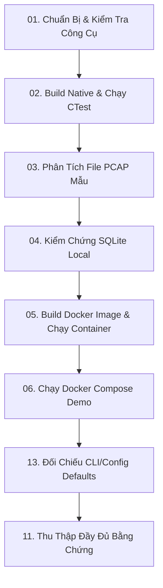

# Hướng Dẫn Build, Deploy, Và Demo Chi Tiết (Mục Lục)

Tài liệu hướng dẫn demo đã được tổ chức lại và chia nhỏ thành **13 phần con** để giúp quá trình theo dõi, thực thi các kịch bản demo và kiểm chứng từng tính năng của hệ thống được dễ dàng, trực quan nhất.

---

## Danh Sách Các Phần Hướng Dẫn Demo

Vui lòng bấm vào liên kết của từng phần để xem hướng dẫn thực hiện chi tiết:

| Phần | Tên Tài Liệu Hướng Dẫn | Nội Dung Chính |
| :--- | :--- | :--- |
| **01** | [Phần 1: Chuẩn Bị Trước Demo](file:///home/nhani05/vdt/passive-network-asset-discovery-system/docs/demo/01-preparation.md) | Yêu cầu môi trường, kiểm tra công cụ, cấu hình SQLite và cấu trúc CLI. |
| **02** | [Phần 2: Build Native Và Chạy Test](file:///home/nhani05/vdt/passive-network-asset-discovery-system/docs/demo/02-build-and-test.md) | Biên dịch native bắt buộc `libpcap`, chạy unit test bằng CTest, và kiểm tra PCAP bằng thư mục `build`. |
| **03** | [Phần 3: Demo PCAP Offline](file:///home/nhani05/vdt/passive-network-asset-discovery-system/docs/demo/03-pcap-offline.md) | Chạy đọc file PCAP mẫu, kiểm chứng Table/JSON/CSV, BPF filter, và event asset mới trên stdout. |
| **04** | [Phần 4: SQLite Local & Tích Hợp](file:///home/nhani05/vdt/passive-network-asset-discovery-system/docs/demo/04-sqlite-local.md) | Cấu hình SQLite, kiểm chứng asset inventory, auto migration và không có event log table. |
| **05** | [Phần 5: Demo Đóng Gói Docker Image](file:///home/nhani05/vdt/passive-network-asset-discovery-system/docs/demo/05-docker-image.md) | Build Docker image, chạy PCAP bằng docker run, và ghi SQLite qua volume writable. |
| **06** | [Phần 6: Demo Triển Khai Với Docker Compose](file:///home/nhani05/vdt/passive-network-asset-discovery-system/docs/demo/06-docker-compose.md) | Chạy `pcap-demo`/`assetd` với SQLite volumes và cách thu dọn dữ liệu. |
| **09** | [Phần 9: Demo Xử Lý Lỗi & Xác Thực](file:///home/nhani05/vdt/passive-network-asset-discovery-system/docs/demo/09-error-handling.md) | Kiểm chứng phản hồi khi nhập sai cú pháp BPF, thiếu file, tham số xung đột, và cơ chế từ chối/báo lỗi di chuyển cho các cờ cũ. |
| **10** | [Phần 10: Demo CLI Help Menu](file:///home/nhani05/vdt/passive-network-asset-discovery-system/docs/demo/10-help-text.md) | Kiểm tra hiển thị thông tin trợ giúp sử dụng cờ `-h`/`--help` trên native và container. |
| **11** | [Phần 11: Checklist Bằng Chứng Demo](file:///home/nhani05/vdt/passive-network-asset-discovery-system/docs/demo/11-evidence-checklist.md) | Bảng tổng hợp 17 bằng chứng cần thu thập (screenshots/logs) trong quá trình thực hiện demo báo cáo. |
| **12** | [Phần 12: Hướng Dẫn Giải Quyết Sự Cố](file:///home/nhani05/vdt/passive-network-asset-discovery-system/docs/demo/12-troubleshooting.md) | Cách khắc phục lỗi `libpcap`, SQLite path/permission, file PCAP và hiệu năng. |
| **13** | [Phần 13: Tham Số CLI, Config Và Giá Trị Mặc Định](file:///home/nhani05/vdt/passive-network-asset-discovery-system/docs/demo/13-cli-parameters.md) | Giải thích CLI PCAP-only, config YAML duy nhất và các cờ đã remove. |

---

## Sơ Đồ Quy Trình Thực Hiện Demo Đề Xuất

Để có kết quả demo hoàn hảo nhất cho toàn bộ hệ thống, bạn nên đi theo trình tự:

```mermaid
graph TD
    A[01. Chuẩn Bị & Kiểm Tra Công Cụ] --> B[02. Build Native & Chạy CTest]
    B --> C[03. Phân Tích File PCAP Mẫu]
    C --> D[04. Kiểm Chứng SQLite Local]
    D --> E[05. Build Docker Image & Chạy Container]
    E --> F[06. Chạy Docker Compose Demo]
    F --> G[13. Đối Chiếu CLI/Config Defaults]
    G --> H[11. Thu Thập Đầy Đủ Bằng Chứng]
```
*(Nếu gặp bất kỳ lỗi nào trong quá trình thực hiện, vui lòng tra cứu nhanh tại **Phần 12: Troubleshooting**).*
