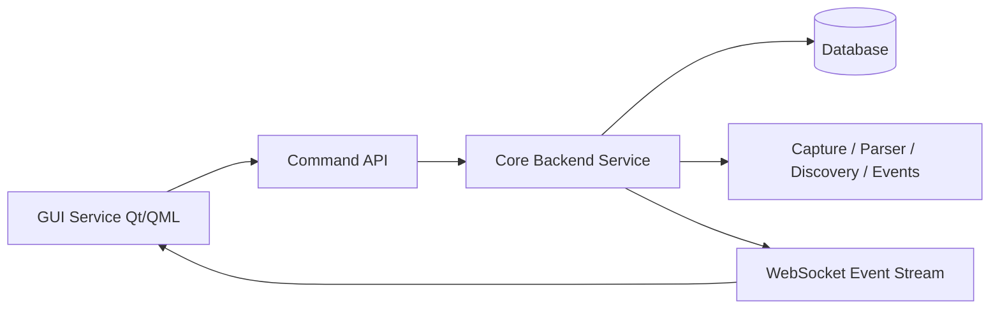

# GUI + Core Service Architecture

## Mục tiêu

Tách ứng dụng desktop hiện tại thành 2 service rõ ràng để:
- giữ giao diện luôn phản hồi nhanh khi backend đang xử lý khối lượng dữ liệu lớn;
- tách trách nhiệm giữa UI và xử lý nghiệp vụ;
- tạo nền tảng để mở rộng thành sản phẩm service trong tương lai.

## Trạng thái hiện tại

Hiện tại, GUI và engine core đang chạy trong cùng một process:
- GUI Qt/QML được khởi tạo từ [src/gui/main.cpp](../../src/gui/main.cpp)
- Logic capture và pipeline xử lý nằm trong [src/gui/CaptureController.cpp](../../src/gui/CaptureController.cpp)

Điều này gây ra vấn đề khi backend xử lý capture/parse/monitoring chiếm CPU nặng, vì UI và core cùng cạnh tranh tài nguyên trong một tiến trình.

## Kiến trúc đề xuất

### Service 1: GUI Service

Vai trò:
- render giao diện Qt/QML;
- điều hướng màn hình;
- gửi lệnh điều khiển: start, stop, config, reload;
- nhận event realtime từ backend và cập nhật UI.

### Service 2: Core Backend Service

Vai trò:
- quản lý capture live hoặc phân tích PCAP;
- chạy pipeline: capture -> parser -> discovery -> event detection;
- ghi dữ liệu vào database;
- phát event cho GUI;
- cung cấp trạng thái và snapshot dữ liệu cho client.

## Sơ đồ kiến trúc

## Giao tiếp giữa 2 service

### 1. Command channel
Sử dụng cho các thao tác điều khiển:
- start capture
- stop capture
- load config
- switch interface
- query status

Khuyến nghị:
- JSON over HTTP/REST hoặc JSON-RPC cho request/response đơn giản.

### 2. Event channel
Sử dụng cho cập nhật realtime:
- asset mới được phát hiện;
- event asset mới;
- trạng thái running/stopped/error;
- progress và warning.

Khuyến nghị:
- WebSocket cho push event theo thời gian thực.

## Shared state

Để UI và backend tách biệt, nên dùng một shared state layer:
- Database: SQLite cho desktop và backend service.
- Snapshot API: backend trả về asset/session hiện tại khi client kết nối hoặc refresh.
- Realtime event không lưu vào database; WebSocket chỉ push trạng thái/asset mới đang diễn ra.

## Phân chia trách nhiệm

| Layer | Service | Trách nhiệm |
| --- | --- | --- |
| Presentation | GUI | Hiển thị, tương tác, điều hướng |
| Control | GUI | Gửi lệnh điều khiển tới backend |
| Processing | Core | Capture, parse, detect, persist |
| Storage | Shared DB | Lưu asset state và session metadata |
| Streaming | WebSocket | Push realtime updates |

## Mức độ triển khai đề xuất

### Phase 1 - Tách ranh giới
- tạo contract giữa GUI và backend;
- tách logic capture khỏi UI controller;
- giữ backend chạy trong process riêng nhưng chưa hoàn toàn độc lập về giao thức.

### Phase 2 - Backend service đầu tiên
- triển khai backend daemon chạy nền;
- hỗ trợ lệnh start/stop/status;
- backend ghi dữ liệu sang DB.

### Phase 3 - Realtime UI
- thêm WebSocket event stream;
- GUI subscribe event và cập nhật UI mà không cần polling.

### Phase 4 - Productization
- thêm auth, logging, metrics, health checks;
- hỗ trợ nhiều client kết nối cùng lúc;
- chuẩn hóa deployment bằng container.

## Khuyến nghị triển khai thực tế cho repo hiện tại

1. Giữ phần Qt/QML hiện tại làm GUI client.
2. Đưa logic xử lý capture sang một backend process riêng.
3. Dùng database làm phần shared state giữa hai service.
4. Dùng WebSocket cho realtime event.
5. Giữ việc phân tích PCAP và live capture trong backend để UI không bị chặn.

## Kết luận

Đây là hướng đi phù hợp cho một sản phẩm service, vì nó tách được:
- UI responsiveness;
- xử lý nghiệp vụ nặng;
- khả năng mở rộng và vận hành lâu dài.
