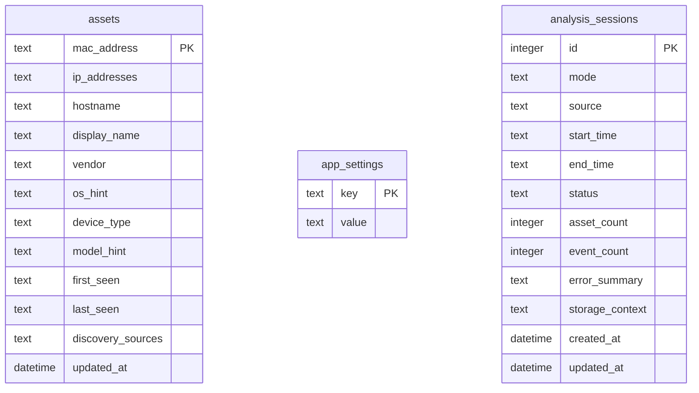
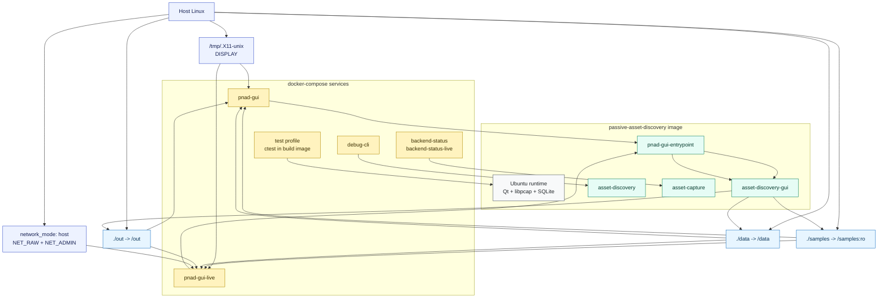

# Thiet Ke Kien Truc He Thong PNAD

Tai lieu nay mo ta kien truc hien tai cua Passive Network Asset Discovery System (PNAD). Cac so do dung Mermaid va co the xem truc tiep trong Markdown viewer ho tro Mermaid, GitHub, VS Code extension, hoac render bang Mermaid CLI.

## Ranh Gioi Runtime Hien Tai

| Runtime | Vai tro | Dau vao | Dau ra |
| --- | --- | --- | --- |
| `asset-discovery` | CLI offline analysis | PCAP/PCAPNG va SQLite path | stdout events, table/json/csv, SQLite assets |
| `asset-discovery-gui` | Desktop app | PCAP/PCAPNG hoac live interface | Dashboard, Assets, Events, SQLite, JSON/CSV export, email alert |
| `asset-capture` | Diagnostic helper | command flags | backend status, protocol self-test |
| Docker `pnad-gui` | GUI demo quyen thap | mounted samples/data/out | native Qt window qua X11 |
| Docker `pnad-gui-live` | GUI live capture | host network interface | native Qt window qua X11, live packet capture |

CLI hien yeu cau SQLite path va ghi ket qua bang upsert/merge theo MAC, khong reset SQLite dich. GUI su dung SQLite nhu storage lau dai cho assets, settings va analysis sessions.

## So Do Tong Quan

```mermaid
flowchart LR
    Operator["Nguoi van hanh"]:::actor
    PcapFile["File PCAP/PCAPNG"]:::input
    NetIf["Network interface"]:::input

    subgraph Entrypoints["Entry points"]
        CLI["asset-discovery<br/>CLI offline"]:::entry
        GUI["asset-discovery-gui<br/>Qt/QML desktop"]:::entry
        Helper["asset-capture<br/>diagnostic helper"]:::entry
    end

    subgraph Core["asset-core va thu vien noi bo"]
        ArgsConfig["Arguments + AppConfig"]:::component
        Capture["PacketCaptureBackend<br/>libpcap offline/live"]:::component
        CoreSession["CoreSession<br/>PCAP/batch orchestration"]:::component
        LivePipeline["LiveCapturePipeline<br/>batching + worker threads"]:::component
        ParserFacade["PacketParserFacade"]:::component
        ParserPlugins["ParserRegistry + plugins<br/>ARP, DHCP, DNS/mDNS/LLMNR,<br/>SSDP, NetBIOS, TCP, IPv4"]:::component
        AssetMonitor["AssetMonitor<br/>new asset events"]:::component
        AssetStore["AssetStore<br/>inventory by MAC"]:::component
        Renderers["Table/JSON/CSV renderers"]:::component
        SQLiteWriter["SQLiteWriter<br/>migrations + writes"]:::component
    end

    subgraph Presentation["Dau ra va hien thi"]
        Terminal["Terminal output<br/>events + table/json/csv"]:::output
        Database[(SQLite<br/>assets, app_settings,<br/>analysis_sessions)]:::storage
        QmlModels["QML models<br/>AssetModel, LogModel,<br/>InterfaceModel"]:::output
        Email["EmailAlertNotifier<br/>curl SMTP"]:::output
        Export["GUI export<br/>CSV/JSON"]:::output
    end

    subgraph Runtime["Runtime/Deployment"]
        Docker["Dockerfile + docker-compose<br/>gui, live, debug, test"]:::runtime
        Env[".env + environment variables"]:::runtime
    end

    Operator --> CLI
    Operator --> GUI
    PcapFile --> CLI
    PcapFile --> GUI
    NetIf --> GUI
    NetIf --> Helper

    CLI --> ArgsConfig
    CLI --> Capture
    CLI --> ParserFacade
    GUI --> ArgsConfig
    GUI --> CoreSession
    GUI --> LivePipeline
    Helper --> Capture

    ArgsConfig --> Capture
    Capture --> CoreSession
    Capture --> LivePipeline
    CoreSession --> LivePipeline
    LivePipeline --> ParserFacade
    ParserFacade --> ParserPlugins
    ParserPlugins --> AssetMonitor
    AssetMonitor --> AssetStore
    AssetStore --> Renderers
    AssetStore --> SQLiteWriter

    AssetMonitor --> Terminal
    AssetMonitor --> QmlModels
    AssetMonitor --> Email
    Renderers --> Terminal
    SQLiteWriter --> Database
    Database --> QmlModels
    QmlModels --> Export

    Docker --> GUI
    Docker --> CLI
    Env --> ArgsConfig
    Env --> Email
    Env --> SQLiteWriter

    classDef actor fill:#fff3bf,stroke:#b08900,color:#3b2f00;
    classDef input fill:#e7f5ff,stroke:#1971c2,color:#0b3558;
    classDef entry fill:#e6fcf5,stroke:#087f5b,color:#063b2e;
    classDef component fill:#f8f9fa,stroke:#495057,color:#212529;
    classDef output fill:#f3f0ff,stroke:#6741d9,color:#2b184d;
    classDef storage fill:#fff0f6,stroke:#c2255c,color:#4b1027;
    classDef runtime fill:#edf2ff,stroke:#364fc7,color:#172153;
```



## Pipeline Xu Ly Packet

```mermaid
flowchart LR
    Source["Nguon packet<br/>PCAP reader hoac live libpcap"]:::input
    Batch["Gom PacketBatch"]:::stage
    PacketQueue[["BoundedQueue&lt;PacketBatch&gt;"]]:::queue

    subgraph ParserWorkers["Parser worker threads"]
        Worker["Parser worker"]:::stage
        Facade["PacketParserFacade"]:::stage
        Registry["ParserEngine + ParserRegistry"]:::stage
        Plugins["Parser plugins<br/>ARP, DHCP, DNS/mDNS/LLMNR,<br/>SSDP, NetBIOS, TCP, IPv4"]:::stage
    end

    ObservationQueue[["BoundedQueue&lt;ObservationBatch&gt;"]]:::queue

    subgraph Aggregator["Aggregator thread"]
        Monitor["AssetMonitor.applyObservation"]:::stage
        Store["AssetStore<br/>merge theo MAC,<br/>first_seen, last_seen,<br/>IP, hostname, metadata"]:::stage
        NewAsset["New asset detection"]:::stage
    end

    Assets["Asset snapshot"]:::output
    Events["AssetEvent callback"]:::output
    Stats["LivePipelineStats / SessionProgress"]:::output

    SQLite["SQLiteWriter<br/>assets + sessions + settings"]:::storage
    Gui["Qt signals -> AssetModel/LogModel"]:::output
    Cli["CLI renderer -> table/json/csv"]:::output
    Email["Email alert for new assets"]:::output

    Source --> Batch --> PacketQueue --> Worker
    Worker --> Facade --> Registry --> Plugins
    Plugins --> ObservationQueue
    ObservationQueue --> Monitor --> Store --> Assets
    Monitor --> NewAsset --> Events
    Batch --> Stats
    Worker --> Stats
    Monitor --> Stats

    Assets --> SQLite
    Assets --> Gui
    Assets --> Cli
    Events --> Gui
    Events --> Cli
    Events --> Email

    classDef input fill:#e7f5ff,stroke:#1971c2,color:#0b3558;
    classDef stage fill:#f8f9fa,stroke:#495057,color:#212529;
    classDef queue fill:#fff9db,stroke:#e67700,color:#4a2b00;
    classDef output fill:#f3f0ff,stroke:#6741d9,color:#2b184d;
    classDef storage fill:#fff0f6,stroke:#c2255c,color:#4b1027;
```



## Storage Model



SQLiteWriter tao schema bang migration dua tren `PRAGMA user_version`. Bang `asset_events` cu da bi loai bo; events hien duoc phat qua stdout/QML/email trong phien chay.

## So Do Trien Khai Docker/Runtime



## Anh Xa Voi Source Code

| Khoi kien truc | Source chinh |
| --- | --- |
| CLI entrypoint | `src/main.cpp`, `src/cli/Arguments.cpp` |
| GUI runtime | `src/gui/GuiApplicationRuntime.cpp`, `src/gui/CaptureController.cpp`, `qml/` |
| Capture backend | `src/capture/PacketCapture.cpp`, `src/capture/NetworkInterface.cpp` |
| Capture helper/protocol | `src/capture/AssetCaptureMain.cpp`, `src/capture/CaptureChildProtocol.cpp` |
| Core session | `src/core/CoreLibrary.cpp`, `include/pnad/core/CoreSession.hpp` |
| Concurrent pipeline | `src/app/LiveCapturePipeline.cpp`, `include/pnad/app/LiveCapturePipeline.hpp` |
| Parser facade/plugins | `src/packet/facade/PacketParserFacade.cpp`, `src/packet/parser-plugins/` |
| Asset inventory | `src/discovery/monitor/AssetMonitor.cpp`, `src/discovery/domain/AssetStore.cpp` |
| Events | `src/event/AssetEvent.cpp`, `src/event/AssetEventDetector.cpp`, `src/event/EventSink.cpp` |
| Storage | `src/storage/SQLiteWriter.cpp` |
| Output/export | `src/discovery/output/`, `src/gui/AssetModel.cpp` |
| Docker runtime | `Dockerfile`, `docker-compose.yml`, `docker/pnad-gui-entrypoint.sh` |

## Filter Va Protocol Coverage

Filter mac dinh:

```text
arp or udp port 67 or udp port 68 or udp port 1900 or udp port 5353
```

Filter nay nham vao ARP, DHCP, SSDP va mDNS. DNS port 53, LLMNR, NetBIOS name service va TCP/IPv4 enrichment can filter rieng hoac `--broad-ipv4-enrichment` trong CLI.
